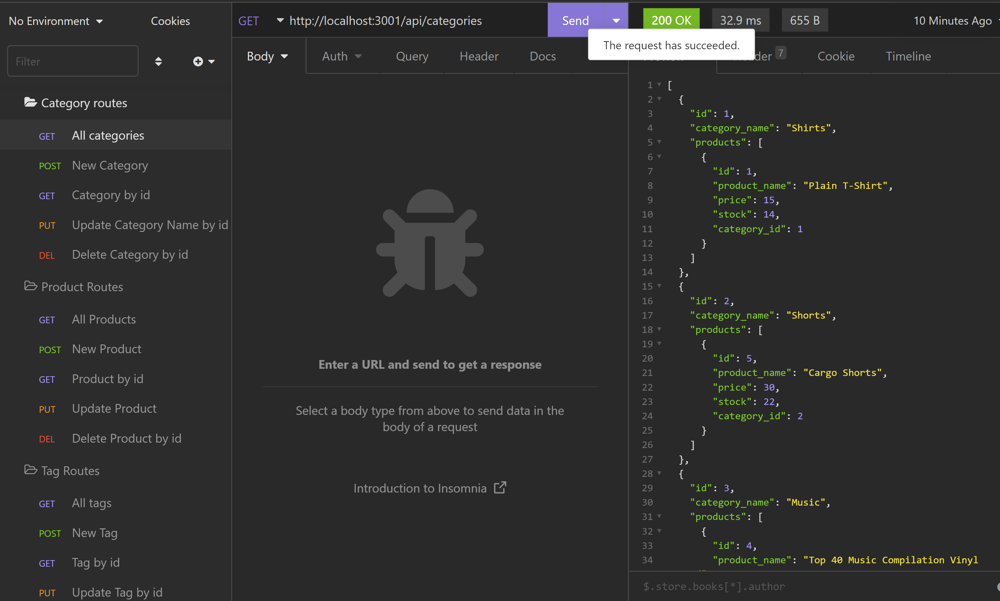

# E-Commerce Back End

This project contains a simple backend for a shopping site that keeps track of the products in a store. 

Product data is stored in a mySQL database created using sequalize. This allows for easy translation between writing SQL queries and JavaScript.

Languages/Libraries used:
-
* Node.js
* mySQL
* Sequalize
* JavaScript

## Table Of Contents
* [Installation](#Installation)
* [Usage](#Usage)
* [License](#License)
* [Contributing](#Contributing)
* [Tests](#tests)
## Installation

* Clone repo
* run "npm install" in the terminal of your project directory to download dependencies
* See the video below on getting the databse set up and testing the routes
https://drive.google.com/file/d/1Bc2PDWUww_KTrxZ6KW6KlS7U03vhAXBq/view
    
## Usage/Examples

Please see the video above for usage instructions.

## License

[MIT](https://choosealicense.com/licenses/mit/)

## Contributing

This project is not currently open for contribution. If you have any questions or concerns, please make a post in the issues section.

## Authors

- [@noothanks](https://www.github.com/noothanks)

## Screenshots

